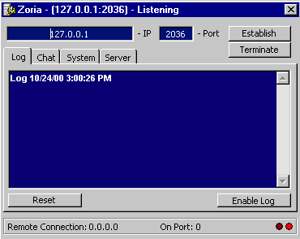



## Client / Server Sample \(TCP/IP\)

### Description

All-in-one client server example using Winsock's TCP/IP.
 
### More Info
 

             |
---                |---
**Submitted On**   |2000-10-24 15:02:18
**By**             |[michael schmidt](https://github.com/Planet-Source-Code/PSCIndex/blob/master/ByAuthor/michael-schmidt.md)
**Level**          |Advanced
**User Rating**    |4.3 (13 globes from 3 users)
**Compatibility**  |VB 6\.0
**Category**       |[Math/ Dates](https://github.com/Planet-Source-Code/PSCIndex/blob/master/ByCategory/math-dates__1-37.md)
**World**          |[Visual Basic](https://github.com/Planet-Source-Code/PSCIndex/blob/master/ByWorld/visual-basic.md)
**Archive File**   |[CODE\_UPLOAD1093410242000\.zip](https://github.com/Planet-Source-Code/michael-schmidt-client-server-sample-tcp-ip__1-12270/archive/master.zip)

